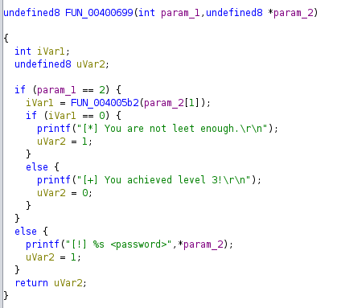
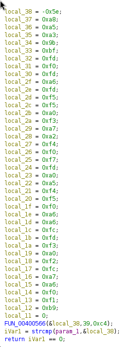
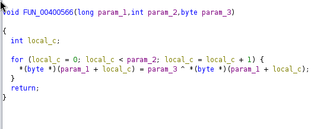
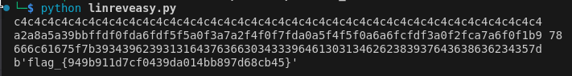

# Lin64_3 Writeup
Was feeling under the weather this week so I just did the first linux challenge.
## Description
Here's a Linux 64-bit binary to sharpen your teeth on - examine it in your favorite disassembler/debugger, and find the flag.

## Solution
Opening the binary file in ghidra, we notice the following function:

In which we can see that we must input a flag into the program, which checks it using the function at 0x4005b2, and if it is correct,
we know we have the flag!

Inside, we see the following:

We can see bytes stored on the stack, and notice that if our inputted password is the same as the bytes after going through 0x400566, we have the flag!

Looking inside the 0x400566 function, we see that it just xors every byte of our password with param_3, which is 0xc4 in this case, and returns it

Now knowing this, we can manually take the stack bytes and xor them with 0xc4 to get our flag! The python code used is located in linreveasy.py

`flag_{949b911d7cf0439da014bb897d68cb45}`