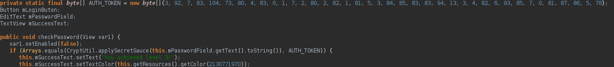
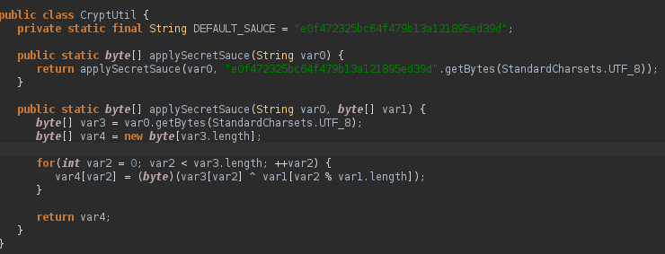
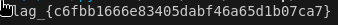

# android3 writeup
## Description
Try apktool or bytecodeviewer to reverse engineer the flag out of this easy Android challenge.
## Writeup
Following the directions, using bytecodeviewer, we can see two interesting files, "MainActivity.class" and "CryptUtil.class" in disaster/playgroup/quarters

In MainActivity.class, as shown below, we can see that we would input a password that must equal the AUTH_TOKEN bytearray after applySecretSauce from CryptUtil

Looking at CryptUtil, we can see that our password gets repeatedly xored with bytes from "e0f472325bc64f479b13a121895ed39d"

For our solution then, since our password ^ repeated e0f472325bc64f479b13a121895ed39d = finalbytearray, password = finalbytearray ^ repeated e0f472325bc64f479b13a121895ed39d

The decryption code can be seen in decrypt.py. One important thing to note is that e0f472325bc64f479b13a121895ed39d does not get evaluated as hex values but ascii characters

`flag_{c6fbb1666e83405dabf46a65d1b07ca7}` and we have our flag!