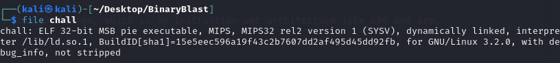
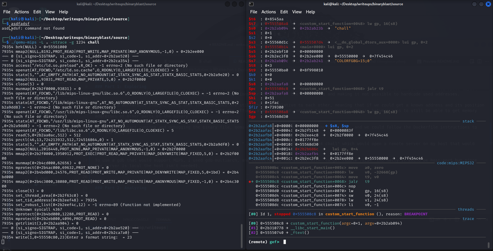
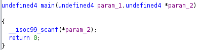
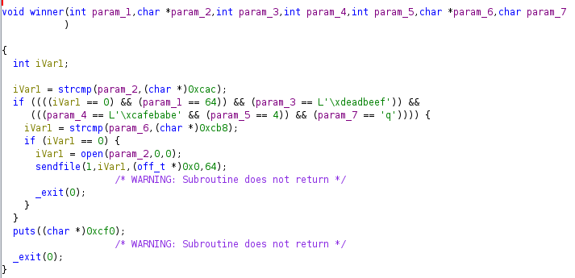
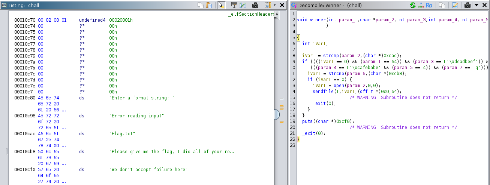
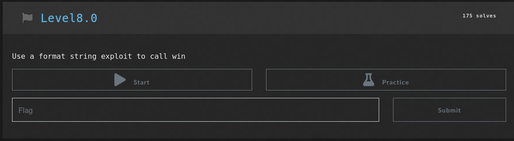

# Binary Blast Writeup
## Description
nc 0.cloud.chals.io 12490

Ready for a blast from the past? Navigate the MIPS landscape and watch out for those sneaky format strings. Beware of fake flags—only the real one will do!

Author: LMS
## Solution
### Part 1: Exploring
Based off of the description, we can see that MIPS will play a role in this challenge, which is an instruction set architecture like x86 and arm. 

Likewise, we can see it when running the "file" command on the binary, also seeing that it is a PIE executable.

PIE, or Position Independent Executable, is used to allow random memory allocation of the executable that is usually used with ASLR, or Address Space Layout Randomization, in order to randomly set address space locations for the data in the executable and making it not possible to hardcode used addresses. 

There is a workaround though, being that the addresses are still the same relative to each other, meaning that if we could get a known address and its position relative to other addresses, we can use the fact that the offsets always remains constant between memory address between runs to still be able to get memory addresses of other parts of the binary.

To actually start running and debugging the binary file, qemu-mips was provided along with the challenge, and we could follow the Dockerfile instructions to run the program. 

Interestingly though, qemu seems to have not emulated ASLR for PIE binaries in a different architecture (https://patchwork.kernel.org/project/qemu-devel/patch/2ddafd9424ab4a30817b8c59e207781d@battelle.org/), requiring a patch that was never implemented. This means that we won't have to deal with ASLR on the binary, meaning that we are essentially not affected by PIE!

To get gef working with the program, I ran "./qemu-mips -L . -strace -g 1234 chall" which would open a remote server on my host that would allow gdb to connect to it.

To use a gdb that would support MIPS, I used gdb-multiarch, and connected to the server with "target remote :1234" (Normally it would be host:port but since the server is local the host isn't needed).

Now we have a working method to dynamically analyze the program! In addition, it seems that format strings might have something to do with this problem...

### Part 2: Analyzing
Opening the binary in ghidra presents us with this decompiled code for the main function:

We can see here that the main function just calls `scanf(*argv)`, which has a format string vulnerability!

This means that using some format specifiers (%s,%x,%p,%n), we can overwrite values in the program!

Looking more into the program, we can see a win function:

We can see here that the win function will take 7 arguments, and if they are all correct, it will open a file!

Looking at the if statements, I found the first parameter as 64, the third parameter as 0xdeadbeef, the fourth parameter as 0xcafebabe, the fifth parameter as 4, and the seventh parameter as 'q'.

Regarding the second and sixth parameters, they involved string comparisons with pointers, which I found the values to in ghidra's listing section.

This gives us the second parameter as "Flag.txt" and the sixth parameter as "Please give me the flag, I did all your requests\n" (I had to open the patch data option to see the rest)

With this, we now have a goal, use format string vulnerabilties to run winner(64, "Flag.txt", 0xdeadbeef, 0xcafebade, 4, "Please give me the flag, I did all your requests\n", "q").
### Part 3: Exploiting
Unfortunately, that was as much progress as I was able to meaningfully make. Remote code execution with format strings isn't something that I have learned just yet, and it didn't help that this challenge didn't use printf() as the vulnerability but rather scanf(), making it much harder for me to try and figure the correct format specifiers.

Taking advice from the lectures, I went ahead and checked out pwn.college, which had its own format string exploits section, which had a challenge that I believed would quickly lead to the solution for this challenge as well.

pwn.college's challenge seems to have the same concept required for this challenge, with this one having the additional requirement of including multiple arguments to the function call, which I believe would likely come relatively quickly after figuring out how to call the function.

pwn.college's challenges do not have writeups per their request though, so unfortunately I wasn't able to get a solution there to apply it to this challenge.

With that, I'll be sure to use pwn.college for working more on binary exploitation, but that's all I was able to accomplish with this challenge.

`flagless :(`