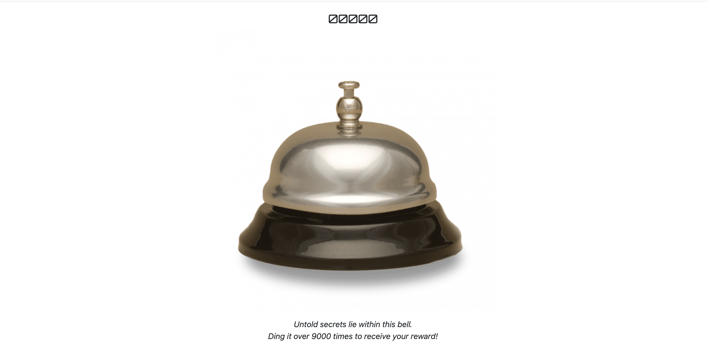
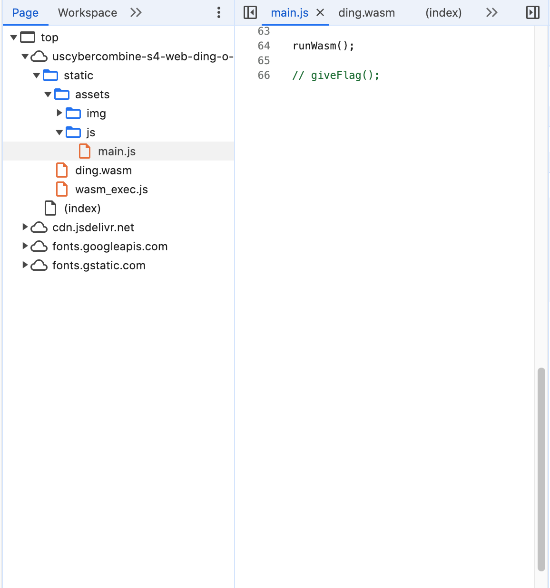
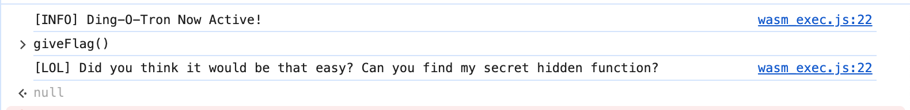
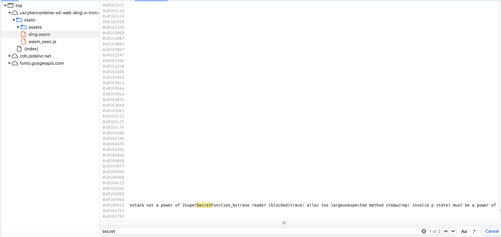
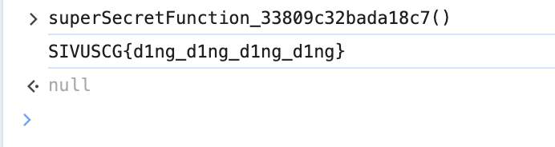
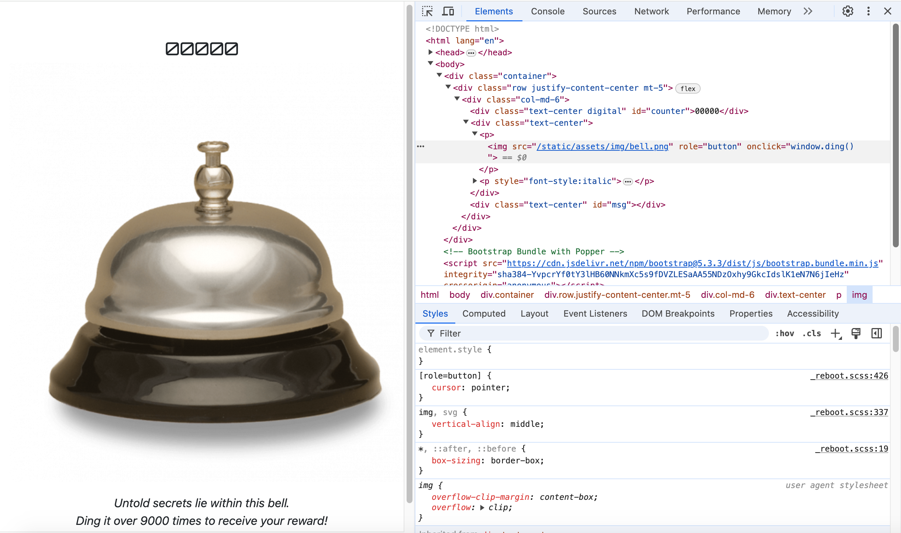
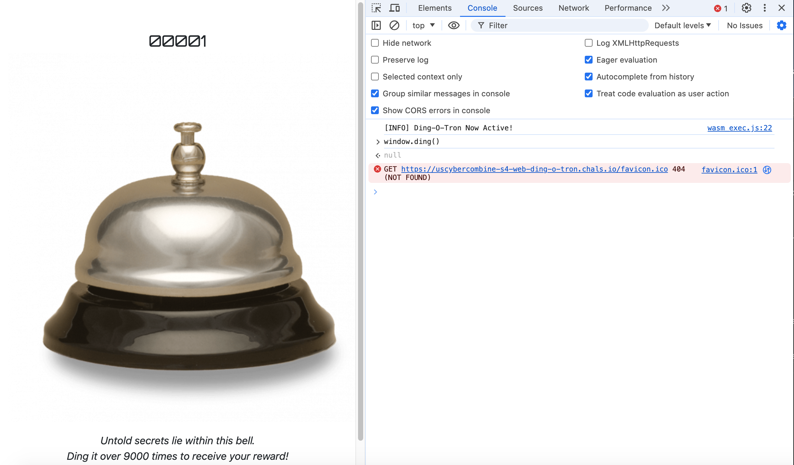
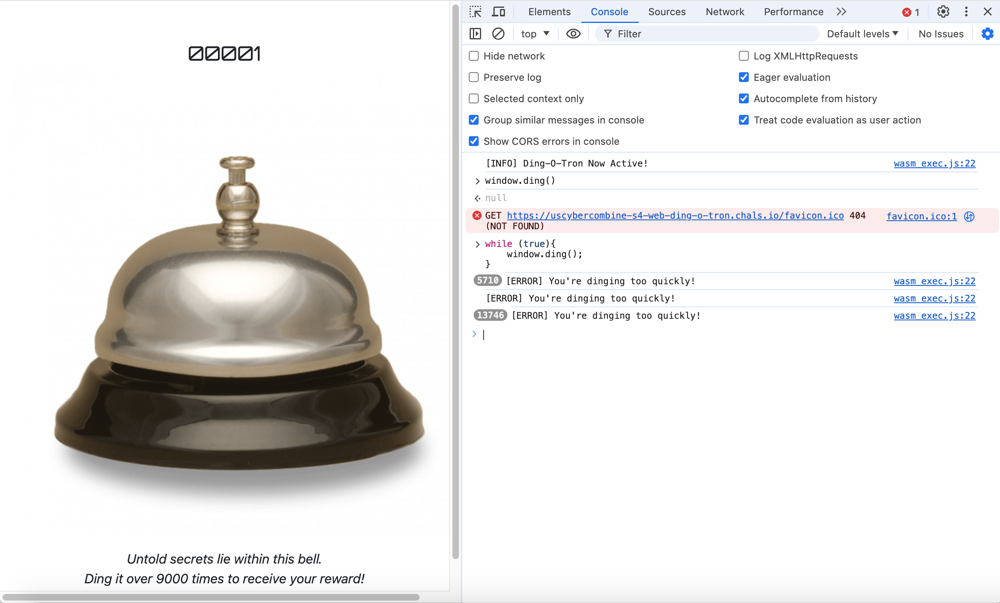
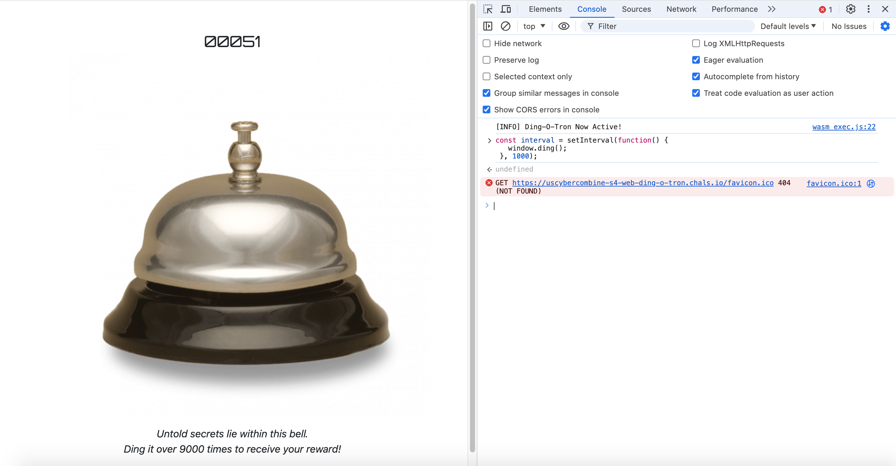
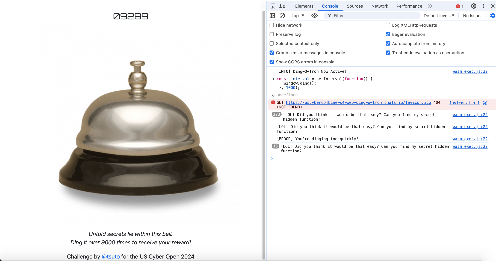

# Ding-O-Tron Writeup
## Description
What came first? The ding...or the flag?

https://uscybercombine-s4-web-ding-o-tron.chals.io/

Author: tsuto
## Solution
Upon visiting the website, we are greeted with a call bell and a prompt telling us to ding it over 9000 times for a reward, presumably the flag.



Inspecting the page, we can find the main.js file, with an interesting comment at the end of the file.



However, attempting to use the giveFlag() function in the web console results in a mocking message and major emotional damage.



The message may still be fruitful though, as it mentions a secret hidden function. 

Looking more into the source files, we come across ding.wasm, also hinted at from the runWasm() function before the commented giveFlag().

Searching for "secret" in ding.wasm results in a very intriguing find: superSecretFunction, hinting at it possibly being the hidden function we need.



Searching for superSecretFunction in the web console autocompletes the rest of the function name for us, and running it gives us the flag.



```
SIVUSCG{d1ng_d1ng_d1ng_d1ng}
```
## Failed Alternative
Looking at the base index.html file, we can see how the counter for the bell works, using window.ding() as a way to increment the counter.



Running the function in the web console ends up incrementing the counter without us having to click.



This possibly allows us to script the calling of the window.ding() function until the counter reaches 9000.

Initially, I tried just infinitely calling the function with a while loop, but unfortunately a cooldown period was implemented.



To try and work around this, I implemented a delay in when we can call the function using setInterval(), finding that the limit was 1 second between calls.



With that, it would only be a matter of time (roughly 3 hours) before 9000 is reached!



Yeah...unfortunately it seems like when it reaches 9000 it calls the giveFlag() function and thus won't actually give us anything.