# StarTrek 1 Writeup
## Description
You are a remote navigator directing Captain Kirk, who is commanding the USS Enterprise, and Captain Spock, who is commanding the USS Endeavour. Your mission is to guide them on a journey 100 galaxies away to an ancient, advanced civilization known as the "Architects" who have hidden a powerful artifact. This artifact, known as the "Quantum Key," has the potential to unlock new dimensions, granting unparalleled knowledge and power to its possessor...

But your ships' warp drives are limited and as you journey through the galaxies, you discover that some contain ancient portal mechanisms that can instantly transport you to another galaxy. These portals are unpredictable and may send you further ahead (Slipstream Portals) or behind (Wormhole Portals) your current position. Can you strategically navigate these worlds and accomplish your mission on limited fuel?

Author: DrBHacking
## Solution
Looking at the problem description, it seems that we want to move 100 galaxies in a Snakes and Ladders like map.

Running the given binary file, we can see that we're given 5 jumps and that there are two starships that we want to give to galaxy 100 starting from galaxy 000. It also seems like we're jumping a different, possibly random, amount of galaxies between the two starships.
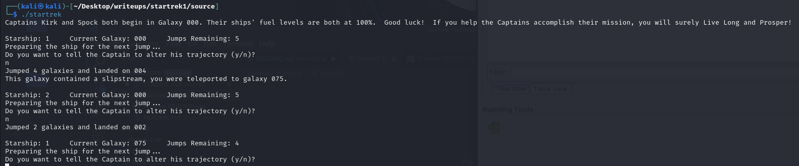

To actually see what is happening in the program, we can analyze the file with Ghidra to get a decompiled version.

### Part 1: Decompiling
We find the following as the decompiled main function.
```
undefined8 main(void)

{
  undefined *puVar1;
  uint uVar2;
  uint uVar3;
  ulong uVar4;
  ulong uVar5;
  ulong uVar6;
  undefined uVar7;
  byte bVar8;
  int iVar9;
  uint uVar10;
  void *pvVar11;
  time_t tVar12;
  long lVar13;
  undefined *puVar14;
  undefined8 *puVar15;
  long in_FS_OFFSET;
  undefined auStack_3e8 [2];
  char local_3e6;
  undefined local_3e5;
  uint local_3e4;
  int local_3e0;
  int local_3dc;
  int local_3d8;
  int local_3d4;
  int local_3d0;
  int local_3cc;
  ulong local_3c8;
  ulong local_3c0;
  ulong local_3b8;
  undefined8 local_3b0;
  undefined *local_3a8;
  undefined8 *local_3a0;
  undefined8 local_398 [2];
  undefined4 local_388;
  undefined4 local_384;
  undefined4 local_34c;
  undefined4 local_328;
  undefined4 local_30c;
  undefined4 local_2e8;
  undefined4 local_2c4;
  undefined4 local_2ac;
  undefined4 local_280;
  undefined4 local_1b0;
  undefined4 local_188;
  undefined4 local_148;
  undefined4 local_134;
  undefined4 local_d4;
  undefined4 local_c0;
  undefined4 local_a4;
  undefined4 local_7c;
  int local_70;
  int local_6c;
  int local_68;
  undefined2 local_5b;
  undefined local_59;
  undefined8 local_58;
  undefined8 local_50;
  undefined8 local_48;
  undefined8 local_40;
  undefined8 local_38;
  undefined8 local_30;
  long local_20;
  
  puVar14 = auStack_3e8;
  local_20 = *(long *)(in_FS_OFFSET + 0x28);
  puVar15 = local_398;
  for (lVar13 = 0x66; lVar13 != 0; lVar13 = lVar13 + -1) {
    *puVar15 = 0;
    puVar15 = puVar15 + 1;
  }
  *(undefined4 *)puVar15 = 0;
  local_70 = 100;
  local_6c = 5;
  local_68 = 2;
  local_280 = 0x5b;
  local_384 = 0xf;
  local_34c = 0x29;
  local_388 = 0x4b;
  local_328 = 0x32;
  local_30c = 0x60;
  local_2e8 = 0x52;
  local_2c4 = 0x5e;
  local_2ac = 0x5f;
  local_7c = 0xc;
  local_a4 = 0x43;
  local_c0 = 0x3e;
  local_d4 = 0x29;
  local_134 = 0x17;
  local_148 = 0x1e;
  local_188 = 8;
  local_1b0 = 3;
  local_3b0 = 1;
  for (; puVar14 != auStack_3e8; puVar14 = puVar14 + -0x1000) {
    *(undefined8 *)(puVar14 + -8) = *(undefined8 *)(puVar14 + -8);
  }
  *(undefined8 *)(puVar14 + -8) = *(undefined8 *)(puVar14 + -8);
  local_3a8 = puVar14 + -0x40;
  for (local_3e4 = 0; (int)local_3e4 < local_68; local_3e4 = local_3e4 + 1) {
    *(uint *)(local_3a8 + (long)(int)local_3e4 * 0x20) = local_3e4 + 1;
    *(undefined4 *)(local_3a8 + (long)(int)local_3e4 * 0x20 + 4) = 0;
    *(int *)(local_3a8 + (long)(int)local_3e4 * 0x20 + 8) = local_6c;
    *(undefined4 *)(local_3a8 + (long)(int)local_3e4 * 0x20 + 0xc) = 0;
    lVar13 = (long)local_6c;
    *(undefined8 *)(puVar14 + -0x48) = 0x1015f9;
    pvVar11 = malloc(lVar13 << 2);
    *(void **)(local_3a8 + (long)(int)local_3e4 * 0x20 + 0x10) = pvVar11;
    lVar13 = (long)local_6c;
    *(undefined8 *)(puVar14 + -0x48) = 0x10162a;
    pvVar11 = malloc(lVar13 << 2);
    *(void **)(local_3a8 + (long)(int)local_3e4 * 0x20 + 0x18) = pvVar11;
  }
  local_58 = 0x56e92c2a50f1771c;
  local_50 = 0x4ce8252c3d980e1d;
  local_48 = 0x418f034e19e3695e;
  local_40 = 0x4ce3f200a84390a;
  local_38 = 0x5e94465550a6395c;
  local_30 = 0x68eb331b48ee6f1b;
  local_3e6 = '\0';
  local_5b = 0;
  local_59 = 0;
  *(undefined8 *)(puVar14 + -0x48) = 0x1016cf;
  tVar12 = time((time_t *)0x0);
  *(undefined8 *)(puVar14 + -0x48) = 0x1016d6;
  srand((uint)tVar12);
  *(undefined8 *)(puVar14 + -0x48) = 0x1016e5;
  puts(
      "Captains Kirk and Spock both begin in Galaxy 000. Their ships\' fuel levels are both at 100%.   Good luck!  If you help the Captains accomplish their mission, you will surely Live Long and  Prosper!"
      );
  do {
    local_3dc = 0;
    for (local_3e4 = 0; (int)local_3e4 < local_68; local_3e4 = local_3e4 + 1) {
      if (0 < *(int *)(local_3a8 + (long)(int)local_3e4 * 0x20 + 8)) {
        local_3dc = local_3dc + *(int *)(local_3a8 + (long)(int)local_3e4 * 0x20 + 8);
        uVar10 = *(uint *)(local_3a8 + (long)(int)local_3e4 * 0x20 + 8);
        uVar2 = *(uint *)(local_3a8 + (long)(int)local_3e4 * 0x20 + 4);
        uVar3 = *(uint *)(local_3a8 + (long)(int)local_3e4 * 0x20);
        *(undefined8 *)(puVar14 + -0x48) = 0x1017aa;
        printf("\nStarship: %d\tCurrent Galaxy: %03d\tJumps Remaining: %d\n",(ulong)uVar3,
               (ulong)uVar2,(ulong)uVar10);
        *(undefined8 *)(puVar14 + -0x48) = 0x1017b9;
        puts("Preparing the ship for the next jump...");
        *(undefined8 *)(puVar14 + -0x48) = 0x1017be;
        iVar9 = rand();
        local_3e0 = iVar9 % 6 + 1;
        *(undefined8 *)(puVar14 + -0x48) = 0x1017f6;
        sleep(1);
        *(undefined8 *)(puVar14 + -0x48) = 0x101805;
        puts("Do you want to tell the Captain to alter his trajectory (y/n)? ");
        *(undefined8 *)(puVar14 + -0x48) = 0x101823;
        __isoc99_scanf(&DAT_00102288,auStack_3e8 + 2);
        while (iVar9 = local_3e0, local_3e6 == 'y') {
          *(undefined8 *)(puVar14 + -0x48) = 0x101837;
          puts(
              "Choose a course heading for the ship, it must be a combination of a letter and a digi t (ie. \'D9\'): "
              );
          *(undefined8 *)(puVar14 + -0x48) = 0x101852;
          __isoc99_scanf(&DAT_001022f4,&local_5b);
          *(undefined8 *)(puVar14 + -0x48) = 0x101857;
          iVar9 = rand();
          local_3cc = iVar9 % 6 + 1;
          *(undefined8 *)(puVar14 + -0x48) = 0x10188f;
          sleep(1);
          *(undefined8 *)(puVar14 + -0x48) = 0x1018a3;
          printf("The Starship is now headed in direction ");
          uVar10 = local_3cc * local_3e0;
          *(undefined8 *)(puVar14 + -0x48) = 0x1018c5;
          printf((char *)&local_5b,(ulong)uVar10);
          *(undefined8 *)(puVar14 + -0x48) = 0x1018cf;
          putchar(10);
          local_3e0 = local_3cc;
          *(undefined8 *)(puVar14 + -0x48) = 0x1018ea;
          puts("Do you wish to modify the trajectory any further (y/n)? ");
          *(undefined8 *)(puVar14 + -0x48) = 0x101908;
          __isoc99_scanf(&DAT_00102288,auStack_3e8 + 2);
        }
        puVar1 = local_3a8 + (long)(int)local_3e4 * 0x20;
        *(undefined8 *)(puVar14 + -0x48) = 0x101948;
        jump(puVar1,iVar9,local_398);
        *(int *)(*(long *)(local_3a8 + (long)(int)local_3e4 * 0x20 + 0x10) +
                (long)*(int *)(local_3a8 + (long)(int)local_3e4 * 0x20 + 8) * 4) = local_3e0;
        *(undefined4 *)
         (*(long *)(local_3a8 + (long)(int)local_3e4 * 0x20 + 0x18) +
         (long)*(int *)(local_3a8 + (long)(int)local_3e4 * 0x20 + 8) * 4) =
             *(undefined4 *)(local_3a8 + (long)(int)local_3e4 * 0x20 + 4);
        if (local_70 <= *(int *)(local_3a8 + (long)(int)local_3e4 * 0x20 + 4)) {
          *(undefined4 *)(local_3a8 + (long)(int)local_3e4 * 0x20 + 8) = 0;
          *(undefined4 *)(local_3a8 + (long)(int)local_3e4 * 0x20 + 0xc) = 0xbaadd00d;
        }
      }
    }
  } while (local_3dc != 0);
  local_3d8 = 0;
  for (local_3e4 = 0; (int)local_3e4 < local_68; local_3e4 = local_3e4 + 1) {
    if (*(int *)(local_3a8 + (long)(int)local_3e4 * 0x20 + 0xc) != 0) {
      local_3d8 = local_3d8 + 1;
    }
  }
  if (local_3d8 == local_68) {
    *(undefined8 *)(puVar14 + -0x48) = 0x101ae7;
    puts(
        "The Architects are impressed by your Space Navigation skills. They have deemed Kirk and Spo ck worthy of the Quantum Key!"
        );
    local_3c8 = 0xcbf29ce484222325;
    local_3a0 = local_398;
    for (local_3e4 = 0; local_3e4 < 0x334; local_3e4 = local_3e4 + 1) {
      local_3c8 = (ulong)*(byte *)((long)local_398 + (long)(int)local_3e4) ^
                  local_3c8 * 0x100000001b3;
    }
    local_3c0 = 0;
    for (local_3e4 = 0; (int)local_3e4 < local_6c; local_3e4 = local_3e4 + 1) {
      local_3c0 = local_3c0 << 10 |
                  (long)(*(int *)((long)(int)local_3e4 * 4 + *(long *)(local_3a8 + 0x38)) *
                         *(int *)((long)(int)local_3e4 * 4 + *(long *)(local_3a8 + 0x30)) ^
                        *(int *)((long)(int)local_3e4 * 4 + *(long *)(local_3a8 + 0x10)) *
                        *(int *)((long)(int)local_3e4 * 4 + *(long *)(local_3a8 + 0x18)));
    }
    for (local_3e4 = 0; (int)local_3e4 < local_6c; local_3e4 = local_3e4 + 1) {
      uVar5 = 1;
      uVar6 = 0;
      uVar4 = local_3c0;
      do {
        if ((local_3c8 & uVar5) != 0) {
          uVar6 = uVar6 | (local_3c8 & uVar5) * (uVar4 & 1);
          uVar4 = uVar4 >> 1;
        }
        uVar5 = uVar5 << 1;
      } while (uVar5 != 0);
      local_3c0 = local_3c0 << 1;
      local_3c8 = ~uVar6;
    }
    for (local_3e4 = 0; (int)local_3e4 < 6; local_3e4 = local_3e4 + 1) {
      (&local_58)[(int)local_3e4] = (&local_58)[(int)local_3e4] ^ local_3c8;
    }
    for (local_3e4 = 0; (int)local_3e4 < local_6c; local_3e4 = local_3e4 + 1) {
      local_3d0 = *(int *)((long)(int)((local_6c + -1) - local_3e4) * 4 +
                          *(long *)(local_3a8 + 0x30)) *
                  *(int *)((long)(int)((local_6c + -1) - local_3e4) * 4 +
                          *(long *)(local_3a8 + 0x10));
      for (local_3d4 = 0; local_3d4 < local_3d0; local_3d4 = local_3d4 + 1) {
        uVar7 = (byte)local_58;
        local_3e5 = (byte)local_58;
        for (local_3b8 = 0; local_3b8 < 0x2f; local_3b8 = local_3b8 + 1) {
          *(undefined *)((long)&local_58 + local_3b8) =
               *(undefined *)((long)&local_58 + local_3b8 + 1);
        }
        local_30 = CONCAT17(uVar7,(undefined7)local_30);
        bVar8 = *(byte *)((long)&local_58 + (long)local_3d0) ^ (byte)local_58;
        local_58._0_1_ = bVar8;
        *(byte *)((long)&local_58 + (long)local_3d0) =
             *(byte *)((long)&local_58 + (long)local_3d0) ^ bVar8;
        local_58 = CONCAT71(local_58._1_7_,
                            *(byte *)((long)&local_58 + (long)local_3d0) ^ (byte)local_58);
      }
    }
  }
  else {
    *(undefined8 *)(puVar14 + -0x48) = 0x101e02;
    puts(
        "You failed to guide both ships to the correct world. The Architects will not relinquish the  Quantum Key!"
        );
  }
  if (local_20 != *(long *)(in_FS_OFFSET + 0x28)) {
                    /* WARNING: Subroutine does not return */
    __stack_chk_fail();
  }
  return 0;
}

```

Using some of the print statements, we can rename some of the variables to their respective values
```

undefined8 main(void)

{
  undefined *puVar1;
  ulong uVar2;
  ulong uVar3;
  ulong uVar4;
  undefined uVar5;
  byte bVar6;
  int iVar7;
  void *pvVar8;
  time_t tVar9;
  long lVar10;
  undefined *puVar11;
  undefined8 *puVar12;
  long in_FS_OFFSET;
  undefined auStack_3e8 [2];
  char local_3e6;
  undefined local_3e5;
  uint i;
  int local_3e0;
  int local_3dc;
  int finishedStarships;
  int local_3d4;
  int local_3d0;
  int local_3cc;
  ulong local_3c8;
  ulong local_3c0;
  ulong local_3b8;
  undefined8 local_3b0;
  undefined *local_3a8;
  undefined8 *local_3a0;
  undefined8 local_398 [2];
  undefined4 local_388;
  undefined4 local_384;
  undefined4 local_34c;
  undefined4 local_328;
  undefined4 local_30c;
  undefined4 local_2e8;
  undefined4 local_2c4;
  undefined4 local_2ac;
  undefined4 local_280;
  undefined4 local_1b0;
  undefined4 local_188;
  undefined4 local_148;
  undefined4 local_134;
  undefined4 local_d4;
  undefined4 local_c0;
  undefined4 local_a4;
  undefined4 local_7c;
  int goal;
  int jumps;
  int starships;
  undefined2 direction;
  undefined local_59;
  undefined8 local_58;
  undefined8 local_50;
  undefined8 local_48;
  undefined8 local_40;
  undefined8 local_38;
  undefined8 local_30;
  long local_20;
  uint currGalaxy;
  uint currStarship;
  uint remJumps;
  
  puVar11 = auStack_3e8;
  local_20 = *(long *)(in_FS_OFFSET + 0x28);
  puVar12 = local_398;
  for (lVar10 = 0x66; lVar10 != 0; lVar10 = lVar10 + -1) {
    *puVar12 = 0;
    puVar12 = puVar12 + 1;
  }
  *(undefined4 *)puVar12 = 0;
  goal = 100;
  jumps = 5;
  starships = 2;
  local_280 = 0x5b;
  local_384 = 0xf;
  local_34c = 0x29;
  local_388 = 0x4b;
  local_328 = 0x32;
  local_30c = 0x60;
  local_2e8 = 0x52;
  local_2c4 = 0x5e;
  local_2ac = 0x5f;
  local_7c = 0xc;
  local_a4 = 0x43;
  local_c0 = 0x3e;
  local_d4 = 0x29;
  local_134 = 0x17;
  local_148 = 0x1e;
  local_188 = 8;
  local_1b0 = 3;
  local_3b0 = 1;
  for (; puVar11 != auStack_3e8; puVar11 = puVar11 + -0x1000) {
    *(undefined8 *)(puVar11 + -8) = *(undefined8 *)(puVar11 + -8);
  }
  *(undefined8 *)(puVar11 + -8) = *(undefined8 *)(puVar11 + -8);
  local_3a8 = puVar11 + -0x40;
  for (i = 0; (int)i < starships; i = i + 1) {
    *(uint *)(local_3a8 + (long)(int)i * 0x20) = i + 1;
    *(undefined4 *)(local_3a8 + (long)(int)i * 0x20 + 4) = 0;
    *(int *)(local_3a8 + (long)(int)i * 0x20 + 8) = jumps;
    *(undefined4 *)(local_3a8 + (long)(int)i * 0x20 + 0xc) = 0;
    lVar10 = (long)jumps;
    *(undefined8 *)(puVar11 + -0x48) = 0x1015f9;
    pvVar8 = malloc(lVar10 << 2);
    *(void **)(local_3a8 + (long)(int)i * 0x20 + 0x10) = pvVar8;
    lVar10 = (long)jumps;
    *(undefined8 *)(puVar11 + -0x48) = 0x10162a;
    pvVar8 = malloc(lVar10 << 2);
    *(void **)(local_3a8 + (long)(int)i * 0x20 + 0x18) = pvVar8;
  }
  local_58 = 0x56e92c2a50f1771c;
  local_50 = 0x4ce8252c3d980e1d;
  local_48 = 0x418f034e19e3695e;
  local_40 = 0x4ce3f200a84390a;
  local_38 = 0x5e94465550a6395c;
  local_30 = 0x68eb331b48ee6f1b;
  local_3e6 = '\0';
  direction = 0;
  local_59 = 0;
  *(undefined8 *)(puVar11 + -0x48) = 0x1016cf;
  tVar9 = time((time_t *)0x0);
  *(undefined8 *)(puVar11 + -0x48) = 0x1016d6;
  srand((uint)tVar9);
  *(undefined8 *)(puVar11 + -0x48) = 0x1016e5;
  puts(
      "Captains Kirk and Spock both begin in Galaxy 000. Their ships\' fuel levels are both at 100%.   Good luck!  If you help the Captains accomplish their mission, you will surely Live Long and  Prosper!"
      );
  do {
    local_3dc = 0;
    for (i = 0; (int)i < starships; i = i + 1) {
      if (0 < *(int *)(local_3a8 + (long)(int)i * 0x20 + 8)) {
        local_3dc = local_3dc + *(int *)(local_3a8 + (long)(int)i * 0x20 + 8);
        remJumps = *(uint *)(local_3a8 + (long)(int)i * 0x20 + 8);
        currGalaxy = *(uint *)(local_3a8 + (long)(int)i * 0x20 + 4);
        currStarship = *(uint *)(local_3a8 + (long)(int)i * 0x20);
        *(undefined8 *)(puVar11 + -0x48) = 0x1017aa;
        printf("\nStarship: %d\tCurrent Galaxy: %03d\tJumps Remaining: %d\n",(ulong)currStarship,
               (ulong)currGalaxy,(ulong)remJumps);
        *(undefined8 *)(puVar11 + -0x48) = 0x1017b9;
        puts("Preparing the ship for the next jump...");
        *(undefined8 *)(puVar11 + -0x48) = 0x1017be;
        iVar7 = rand();
        local_3e0 = iVar7 % 6 + 1;
        *(undefined8 *)(puVar11 + -0x48) = 0x1017f6;
        sleep(1);
        *(undefined8 *)(puVar11 + -0x48) = 0x101805;
        puts("Do you want to tell the Captain to alter his trajectory (y/n)? ");
        *(undefined8 *)(puVar11 + -0x48) = 0x101823;
        __isoc99_scanf(&DAT_00102288,auStack_3e8 + 2);
        while (iVar7 = local_3e0, local_3e6 == 'y') {
          *(undefined8 *)(puVar11 + -0x48) = 0x101837;
          puts(
              "Choose a course heading for the ship, it must be a combination of a letter and a digi t (ie. \'D9\'): "
              );
          *(undefined8 *)(puVar11 + -0x48) = 0x101852;
          __isoc99_scanf(&DAT_001022f4,&direction);
          *(undefined8 *)(puVar11 + -0x48) = 0x101857;
          iVar7 = rand();
          local_3cc = iVar7 % 6 + 1;
          *(undefined8 *)(puVar11 + -0x48) = 0x10188f;
          sleep(1);
          *(undefined8 *)(puVar11 + -0x48) = 0x1018a3;
          printf("The Starship is now headed in direction ");
          remJumps = local_3cc * local_3e0;
          *(undefined8 *)(puVar11 + -0x48) = 0x1018c5;
          printf((char *)&direction,(ulong)remJumps);
          *(undefined8 *)(puVar11 + -0x48) = 0x1018cf;
          putchar(10);
          local_3e0 = local_3cc;
          *(undefined8 *)(puVar11 + -0x48) = 0x1018ea;
          puts("Do you wish to modify the trajectory any further (y/n)? ");
          *(undefined8 *)(puVar11 + -0x48) = 0x101908;
          __isoc99_scanf(&DAT_00102288,auStack_3e8 + 2);
        }
        puVar1 = local_3a8 + (long)(int)i * 0x20;
        *(undefined8 *)(puVar11 + -0x48) = 0x101948;
        jump(puVar1,iVar7,local_398);
        *(int *)(*(long *)(local_3a8 + (long)(int)i * 0x20 + 0x10) +
                (long)*(int *)(local_3a8 + (long)(int)i * 0x20 + 8) * 4) = local_3e0;
        *(undefined4 *)
         (*(long *)(local_3a8 + (long)(int)i * 0x20 + 0x18) +
         (long)*(int *)(local_3a8 + (long)(int)i * 0x20 + 8) * 4) =
             *(undefined4 *)(local_3a8 + (long)(int)i * 0x20 + 4);
        if (goal <= *(int *)(local_3a8 + (long)(int)i * 0x20 + 4)) {
          *(undefined4 *)(local_3a8 + (long)(int)i * 0x20 + 8) = 0;
          *(undefined4 *)(local_3a8 + (long)(int)i * 0x20 + 0xc) = 0xbaadd00d;
        }
      }
    }
  } while (local_3dc != 0);
  finishedStarships = 0;
  for (i = 0; (int)i < starships; i = i + 1) {
    if (*(int *)(local_3a8 + (long)(int)i * 0x20 + 0xc) != 0) {
      finishedStarships = finishedStarships + 1;
    }
  }
  if (finishedStarships == starships) {
    *(undefined8 *)(puVar11 + -0x48) = 0x101ae7;
    puts(
        "The Architects are impressed by your Space Navigation skills. They have deemed Kirk and Spo ck worthy of the Quantum Key!"
        );
    local_3c8 = 0xcbf29ce484222325;
    local_3a0 = local_398;
    for (i = 0; i < 0x334; i = i + 1) {
      local_3c8 = (ulong)*(byte *)((long)local_398 + (long)(int)i) ^ local_3c8 * 0x100000001b3;
    }
    local_3c0 = 0;
    for (i = 0; (int)i < jumps; i = i + 1) {
      local_3c0 = local_3c0 << 10 |
                  (long)(*(int *)((long)(int)i * 4 + *(long *)(local_3a8 + 0x38)) *
                         *(int *)((long)(int)i * 4 + *(long *)(local_3a8 + 0x30)) ^
                        *(int *)((long)(int)i * 4 + *(long *)(local_3a8 + 0x10)) *
                        *(int *)((long)(int)i * 4 + *(long *)(local_3a8 + 0x18)));
    }
    for (i = 0; (int)i < jumps; i = i + 1) {
      uVar3 = 1;
      uVar4 = 0;
      uVar2 = local_3c0;
      do {
        if ((local_3c8 & uVar3) != 0) {
          uVar4 = uVar4 | (local_3c8 & uVar3) * (uVar2 & 1);
          uVar2 = uVar2 >> 1;
        }
        uVar3 = uVar3 << 1;
      } while (uVar3 != 0);
      local_3c0 = local_3c0 << 1;
      local_3c8 = ~uVar4;
    }
    for (i = 0; (int)i < 6; i = i + 1) {
      (&local_58)[(int)i] = (&local_58)[(int)i] ^ local_3c8;
    }
    for (i = 0; (int)i < jumps; i = i + 1) {
      local_3d0 = *(int *)((long)(int)((jumps + -1) - i) * 4 + *(long *)(local_3a8 + 0x30)) *
                  *(int *)((long)(int)((jumps + -1) - i) * 4 + *(long *)(local_3a8 + 0x10));
      for (local_3d4 = 0; local_3d4 < local_3d0; local_3d4 = local_3d4 + 1) {
        uVar5 = (byte)local_58;
        local_3e5 = (byte)local_58;
        for (local_3b8 = 0; local_3b8 < 0x2f; local_3b8 = local_3b8 + 1) {
          *(undefined *)((long)&local_58 + local_3b8) =
               *(undefined *)((long)&local_58 + local_3b8 + 1);
        }
        local_30 = CONCAT17(uVar5,(undefined7)local_30);
        bVar6 = *(byte *)((long)&local_58 + (long)local_3d0) ^ (byte)local_58;
        local_58._0_1_ = bVar6;
        *(byte *)((long)&local_58 + (long)local_3d0) =
             *(byte *)((long)&local_58 + (long)local_3d0) ^ bVar6;
        local_58 = CONCAT71(local_58._1_7_,
                            *(byte *)((long)&local_58 + (long)local_3d0) ^ (byte)local_58);
      }
    }
  }
  else {
    *(undefined8 *)(puVar11 + -0x48) = 0x101e02;
    puts(
        "You failed to guide both ships to the correct world. The Architects will not relinquish the  Quantum Key!"
        );
  }
  if (local_20 != *(long *)(in_FS_OFFSET + 0x28)) {
                    /* WARNING: Subroutine does not return */
    __stack_chk_fail();
  }
  return 0;
}
```

Looking through the main function, we can notice an interesting function call that should be relevant to the solution:
```
jump(puVar1,iVar7,local_398);
```

Looking at the jump function itself, we can see the logic behind how the starships can move.
```
void jump(long param_1,uint param_2,long param_3)

{
  uint uVar1;
  uint local_10;
  
  if (((int)param_2 < 7) && (0 < (int)param_2)) {
    uVar1 = param_2 + *(int *)(param_1 + 4);
    printf("Jumped %d galaxies and landed on %03d\n",(ulong)param_2,(ulong)uVar1);
    if (*(int *)(param_3 + (long)(int)uVar1 * 4) == 0) {
      local_10 = uVar1;
      if (*(int *)(param_3 + 4 + ((long)(int)uVar1 + 100) * 4) != 0) {
        local_10 = *(uint *)(param_3 + 4 + ((long)(int)uVar1 + 100) * 4);
        *(undefined4 *)(param_3 + 4 + ((long)(int)uVar1 + 100) * 4) = 0;
        printf("This galaxy contained a wormhole, you were teleported to galaxy %03d.\n",
               (ulong)local_10);
      }
    }
    else {
      local_10 = *(uint *)(param_3 + (long)(int)uVar1 * 4);
      *(undefined4 *)(param_3 + (long)(int)uVar1 * 4) = 0;
      printf("This galaxy contained a slipstream, you were teleported to galaxy %03d.\n",
             (ulong)local_10);
    }
    *(uint *)(param_1 + 4) = local_10;
  }
  else {
    puts("Impossible trajectory! Are your instruments calibrated??\nYou have just wasted fuel.");
  }
  *(int *)(param_1 + 8) = *(int *)(param_1 + 8) + -1;
  return;
}
```

Renaming some of the variables in this function as well gives us this:
```
void jump(long param_1,uint jumped,long param_3)

{
  uint newgalaxy;
  uint teleportedgalaxy;
  
  if (((int)jumped < 7) && (0 < (int)jumped)) {
    newgalaxy = jumped + *(int *)(param_1 + 4);
    printf("Jumped %d galaxies and landed on %03d\n",(ulong)jumped,(ulong)newgalaxy);
    if (*(int *)(param_3 + (long)(int)newgalaxy * 4) == 0) {
      teleportedgalaxy = newgalaxy;
      if (*(int *)(param_3 + 4 + ((long)(int)newgalaxy + 100) * 4) != 0) {
        teleportedgalaxy = *(uint *)(param_3 + 4 + ((long)(int)newgalaxy + 100) * 4);
        *(undefined4 *)(param_3 + 4 + ((long)(int)newgalaxy + 100) * 4) = 0;
        printf("This galaxy contained a wormhole, you were teleported to galaxy %03d.\n",
               (ulong)teleportedgalaxy);
      }
    }
    else {
      teleportedgalaxy = *(uint *)(param_3 + (long)(int)newgalaxy * 4);
      *(undefined4 *)(param_3 + (long)(int)newgalaxy * 4) = 0;
      printf("This galaxy contained a slipstream, you were teleported to galaxy %03d.\n",
             (ulong)teleportedgalaxy);
    }
    *(uint *)(param_1 + 4) = teleportedgalaxy;
  }
  else {
    puts("Impossible trajectory! Are your instruments calibrated??\nYou have just wasted fuel.");
  }
  *(int *)(param_1 + 8) = *(int *)(param_1 + 8) + -1;
  return;
}
```
We now notice that the second argument to the function corresponds to the number of galaxies the starship moves, and can now apply that to the call in the main function.
```
jump(puVar1,jumped,local_398);
```

Looking back over the main code, we see something very interesting as to what the calculations for jumped are.
```
jumped = rand();
local_3cc = jumped % 6 + 1;
```
Given this code, we can now assume that the starships jump a random number between 1-6 galaxies (Ghidra attributes it to a different variable but it likely is an error with the decompiling).

Furthermore, the code is contained inside of a while loop that repeats itself while we wish to modify the trajectory of a starship, allowing us to possibly view how far the starship will jump and then reroll it until it becomes what we want.

Looking at the corresponding disassembly to that statement, we can see that by looking at the eax (or rax), we will see the jump amount.

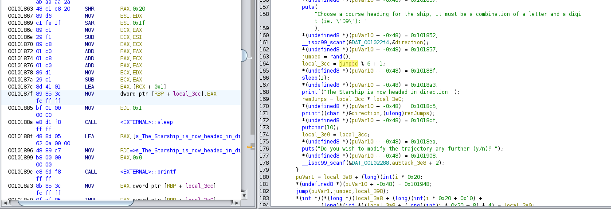

Now we can come up with the following strategy to get the starships to galaxy 100:
1. Come up with jump amounts beforehand to get both ships to 100.
2. View the rax value when it reaches the jump calculation to see how far it is.
3. Reroll until the rax value matches our predetermined jump amount.

### Part 2: Getting the Map
Given that the map and the teleportation portals are going to be constant, it should allow running many instances of going through random jump values to try and explore all of the spaces and where all of the portals jump.

To do so, I created the following python program:
```
from pwn import *
from pwntools import *
galaxies = {} #{2: 2, 1: 1, 7: 7, 9: 9, 11: 11, 14: 14, 15: 15, 16: 16, 5: 15, 3: 3, 6: 6, 19: 41, 46: 46, 12: 12, 52: 23, 4: 75, 18: 18, 80: 80, 76: 41, 43: 43, 51: 51, 8: 8, 83: 83, 85: 85, 91: 91, 81: 62, 64: 64, 70: 91, 94: 94, 77: 77, 65: 65, 10: 10, 17: 17, 79: 79, 84: 84, 87: 87, 44: 82, 47: 30, 21: 3, 31: 8, 88: 67, 35: 96}
# key is galaxy, value is where it goes to
while True:
    p = process("./startrek")
    p.recvuntil(b"(y/n)?")
    p.send(b"n")
    while True:
        try:
            result = p.recvuntil(b"(y/n)?").decode('utf-8')
            landed = int(result[result.index("landed on ") + len("landed on "): result.index("landed on ") + len("landed on ")+3])
            try:
                galaxies[landed] = galaxies[landed]
            except: 
                if "This galaxy contained" in result:
                    new = result[result.index("you were teleported to galaxy ") + len("you were teleported to galaxy "): result.index("you were teleported to galaxy ") + len("you were teleported to galaxy ")+3]
                    galaxies[landed] = int(new)
                else:
                    galaxies[landed] = landed
            p.send(b"n")
        except:
            break
    print(galaxies)
    print(sorted(galaxies.keys()))
```
The idea behind the program is to constantly run the program, accept whatever jump amount we're given by sending "n" when given a prompt to change trajectory, and see if the space we landed on had a portal by looking for additional output regarding teleporting. We then can use a dictionary to map a galaxy to the galaxy it teleports to, or itself if there is no portal.

After letting the program run for some time, it discovered the following spaces and their mappings:
```
{2: 2, 1: 1, 7: 7, 9: 9, 11: 11, 14: 14, 15: 15, 16: 16, 5: 15, 3: 3, 6: 6, 19: 41, 46: 46, 12: 12, 52: 23, 4: 75, 18: 18, 80: 80, 76: 41, 43: 43, 51: 51, 8: 8, 83: 83, 85: 85, 91: 91, 81: 62, 64: 64, 70: 91, 94: 94, 77: 77, 65: 65, 10: 10, 17: 17, 79: 79, 84: 84, 87: 87, 44: 82, 47: 30, 21: 3, 31: 8, 88: 67, 35: 96}
```

This map gives us a solution:
0 -> 5 (teleport to 15) -> 19 (teleport to 41) -> 47 (teleport to 30) -> 35 (teleport to 96) -> 100
Leading to us wanting jumps of distance 5, 4, 6, 5, 4

### Part 3: Getting the Flag
Now that we know what jumps we want, we need to figure out a way to see the rax values while the program is running. To do so, I used GEF (GDB Enhanced Features).

To find the spots where the jump amount moves into rax, we can use `disas main` and look nearby any instance of "rand" in the output, leading us to *(main+1093) and *(main+1246) as breakpoints we should use to see the rax value for the jump amount.

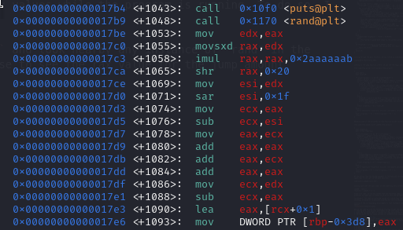
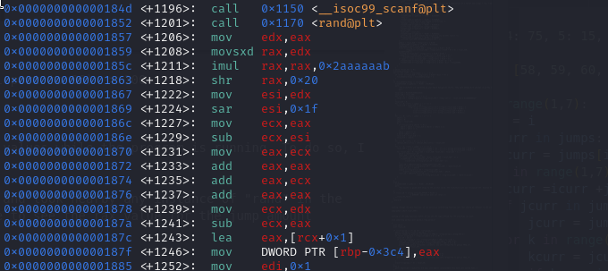

Using `b *(main+1093)` and `b *(main+1246)` we can now use `r` to run the program and use `c` to move between breakpoints.

Now, following our jumps of 5, 4, 6, 5, 4, we can look at the rax value, and submit "n" when the value is the jump amount we want:

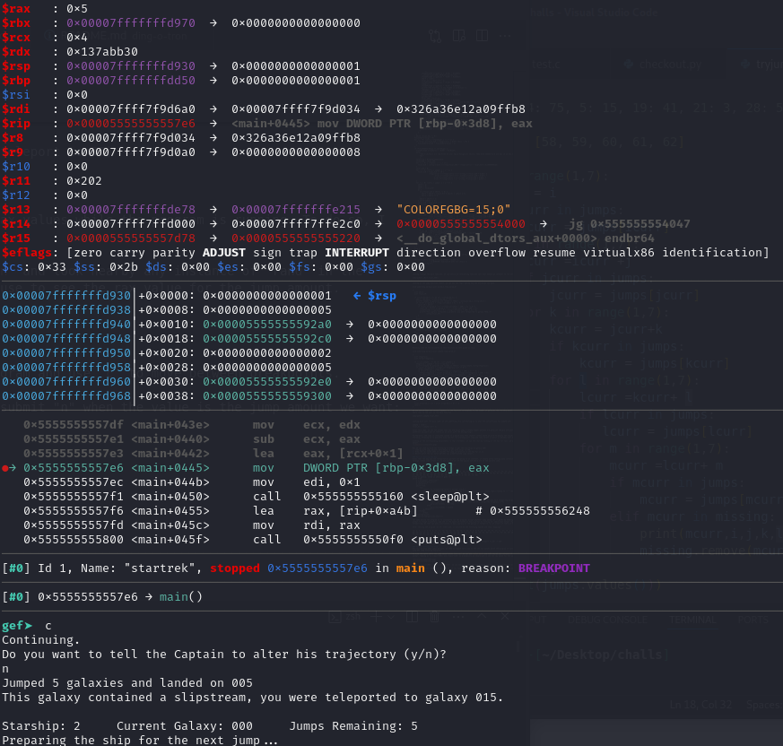

Or "y" and then any two characters when the value is not what we want to reroll it:

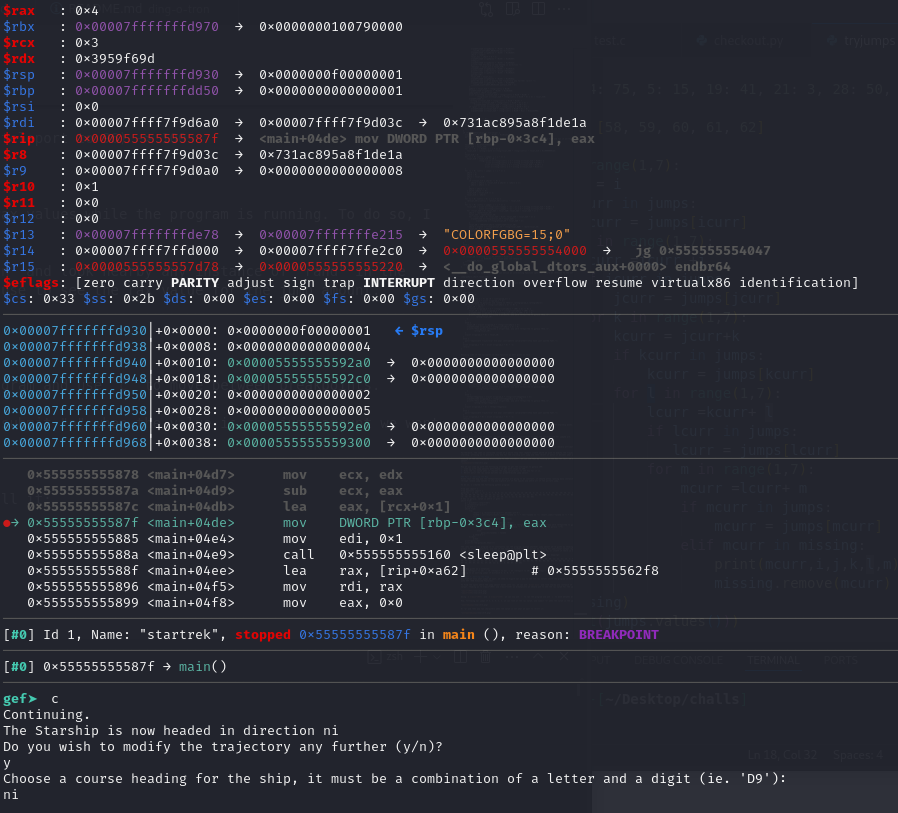

Now we can roll for the jumps on both spaceships and we should get the flag!

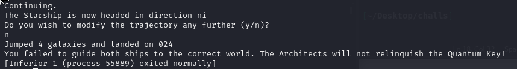

Oh...what happened?
Looking back at the output, we can see that starship 1 did correctly end up at galaxy 100, but starship 2 is far behind!

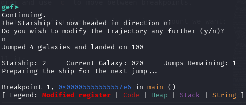

Looking back even further, we can see the culprit.

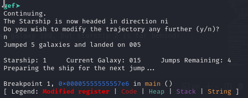

Starship 2 never went in the portal! Why???

### Part 4: Getting the Map (again)
Going back to the jump function, we can see the reason behind it all.
```
if (*(int *)(param_3 + 4 + ((long)(int)newgalaxy + 100) * 4) != 0) {
        teleportedgalaxy = *(uint *)(param_3 + 4 + ((long)(int)newgalaxy + 100) * 4);
        *(undefined4 *)(param_3 + 4 + ((long)(int)newgalaxy + 100) * 4) = 0;
        printf("This galaxy contained a wormhole, you were teleported to galaxy %03d.\n",
               (ulong)teleportedgalaxy);
}
```
The program uses pointer values to see if a spot is a portal or not, and if it finds a spot that is a portal, it teleports the starship and then closes the portal!

This means that we can't reuse the same portal sequence between the two starships, so we need to find another path to get to 100.
Unfortunately, the previous python program feasibly couldn't get to new spaces to find new portals quickly.

Fortunately though, we can use the fact that we can control our jumps using gef to look for new spaces ourselves!
Using the following program I made, I tested all possible movements in the five jumps using the portal jumps to see how we can reach spaces we haven't visited before.

```
jumps = {} #{4: 75, 5: 15, 19: 41, 21: 3, 28: 50, 31: 8, 35: 96, 44: 82, 47: 30, 52: 23, 70: 91, 76: 41, 81: 62, 88: 67,53:94}
missing = [] #[58, 59, 60, 61, 62]

for i in range(1,7):
    icurr = i
    if icurr in jumps:
        icurr = jumps[icurr]
    for j in range(1,7):
        jcurr =icurr +j
        if jcurr in jumps:
            jcurr = jumps[jcurr]
        for k in range(1,7):
            kcurr = jcurr+k
            if kcurr in jumps:
                kcurr = jumps[kcurr]
            for l in range(1,7):
                lcurr =kcurr+ l
                if lcurr in jumps:
                   lcurr = jumps[lcurr]
                for m in range(1,7):
                    mcurr =lcurr+ m
                    if mcurr in jumps:
                        mcurr = jumps[mcurr]
                    elif mcurr in missing:
                        print(mcurr,i,j,k,l,m)
                        missing.remove(mcurr)
```

Using the program to map out where to jump, after a long time of exploring the map, I found the following new portals: 
```
{44: 82, 47: 30, 52: 23, 70: 91, 76: 41, 81: 62, 88: 67,53:94}
```
The portal between 53 and 94 seemed very interesting, as from 94 we could jump 6 straight to 100, so I looked to see if there was a way we could use it.

After a long think, I found the paths to 100 for both starships:

Starship 1: 0 -> 5 (teleport to 15) -> 19 (teleport to 41) -> 47 (teleport to 30) -> 35 (teleport to 96) -> 100

Starship 2: 0 -> 4 (teleport to 75) -> 76 (teleport to 41) -> 47 (no teleport since Starship 1 used it) -> 53 (teleport to 94) -> 100

### Part 5: Getting the Flag (for real this time)
Now we can figure out the jump amount for both ships, being 5, 4, 6, 5, 4 for Starship 1 and 4, 1, 6, 6, 6 for Starship 2.

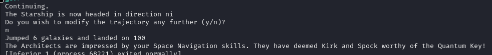

We did it! So... where's the flag?

Well, it turns out that the program doesn't actually print out the flag when the win condition is met, but rather calculate the flag and store it in the stack.

This means that (annoyingly) we have to restart the rerolls and add an additional breakpoint where the calculations finish or step through the assembly instructions after we submit the final jump.

I opted to just do stepping by using "n" instead of "c" at the end to go until the main function returns, which should be around when the flag finishing calculating.

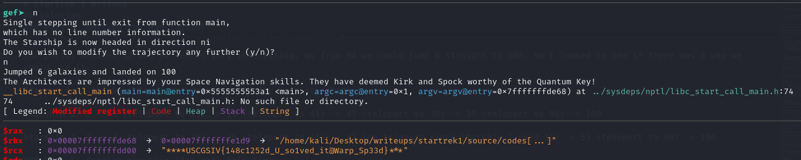

`USCGSIV{148c1252d_U_so1ved_it@Warp_Sp33d}`