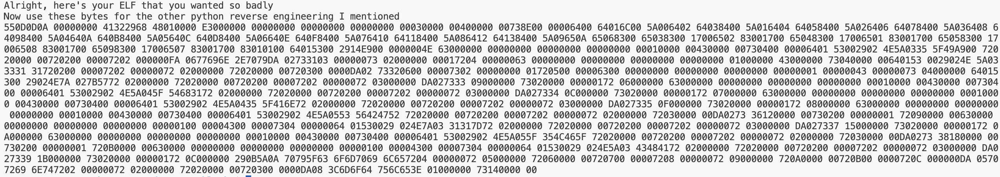
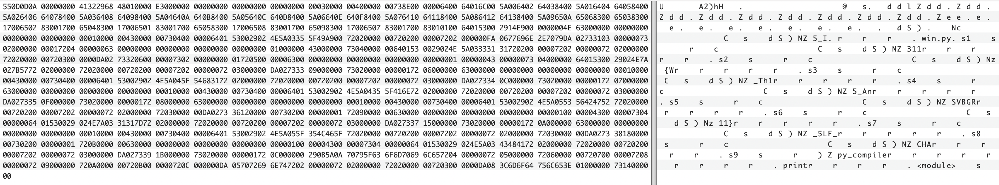
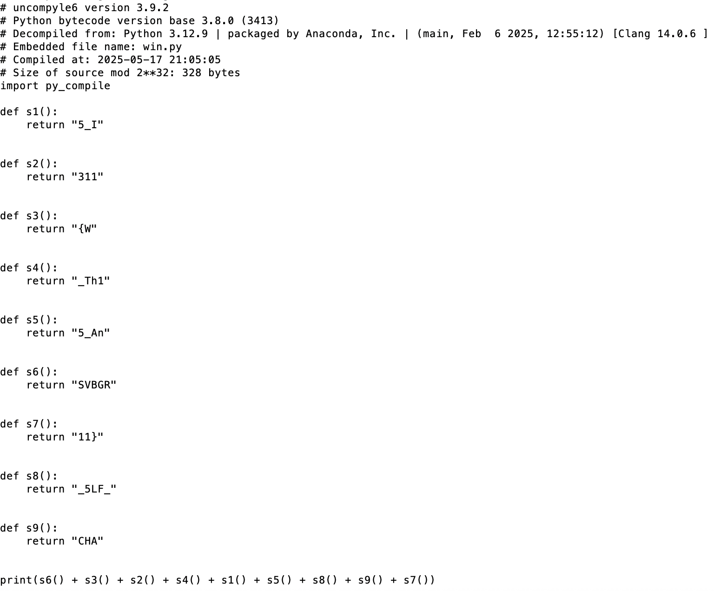
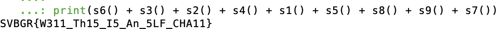

# The Magic of Bytes Writeup
"I heard my friend wants to prepare for the new AP Cybersecurity CollegeBoard is adding soon, so I prepared a challenge with two python reverse engineering techniques. He insisted on it having an ELF binary though, so I also included it. Can you solve the challenge?"
## Solution
We are presented with two files: bytes.txt and chall.py

In chall.py we see that the program shifts the bytes of an ELF file by an unknown constant and outputs the result to bytes.txt

Either by knowing that the magic number of an ELF file is 7F454C46 or by deducing that the large amount of 9's would come from the large amount of 0's in the file, we can determine the shift offset to be 9

Thus, by subtracting the ascii value of each character in bytes.txt by 9, we can get the ELF binary bytes

```
ciphertext = "INSERT BYTES HERE"
def yes_so_fast(ELF_bytes,key):
    message = ""
    for i in range(len(ELF_bytes)):
        message += chr(ord(ELF_bytes[i]) - key)
    print(len(message))
    return message

print(yes_so_fast(ciphertext,9))
```

Inserting the bytes into a hex editor, we can download and run the binary file to reach the next step of the challenge



Once again inserting the bytes into a hex editor, we can either notice that the file is python 3.8 byte-compiled or that the hex data contains "py_compile"



Either way, we can conclude that we are given python bytecode, which we can decode using uncompyle6 since the python is version 3.8.

By running the command on the bytecode as a .pyc file, we get the decompiled python code that when run gives us the flag.





`SVBGR{W311_Th15_I5_An_5LF_CHA11}`