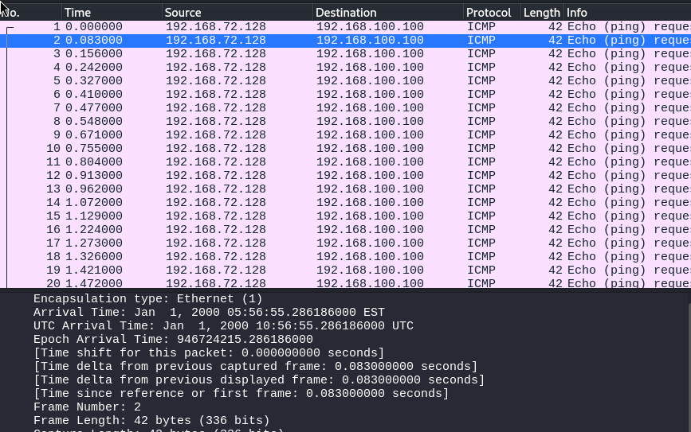
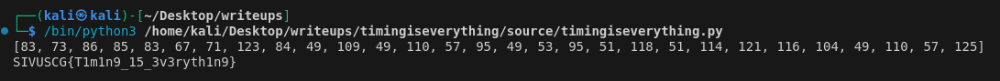

# Timing Is Everything Writeup
## Description
Timing is everything....

Author: r0m
## Solution
Looking at the problem description, and the title it's implied that time will play a role in the solution.

Opening the given pcap file in WireShark, we can see that 30 suspiciously similar packets were sent.


Upon closer inspection, we can see that they actually are practically identical! Everything from the source, destination, protocol, and the actual data are all the same between the 30 packets. The only difference between them is the time that they are sent in, hinting again to the title and description.

However, just the times themselves don't seem to reveal anything yet, so I opened up a frame to see more time statistics that could give clues, which revealed "Time delta from previous captured frame".



This seems much more promising than just the plain time values, since these could actually fluctuate up and down.

Looking at this statistic for the packets, I saw that the values were around 0.050 to 0.110, which when scaled up to 50 to 110, hints at possibly there being ASCII values being used here.

To test out this theory, I took the differences, multiplied them by 1000, and tried converting them back into characters using Python.
```
differences = [0.083,0.073,0.086,0.085,0.083,0.067,0.071,0.123,0.084,0.049,0.109,0.049,0.110,0.057,0.095,0.049,0.053,0.095,0.051,0.118,0.051,0.114,0.121,0.116,0.104,0.049,0.110,0.057,0.125]
differences = [int(i * 1000) for i in differences] 
print(differences)
print("".join(chr(i) for i in differences))
```



And we can see here that it ended up working!

`SIVUSCG{T1m1n9_15_3v3ryth1n9}`
